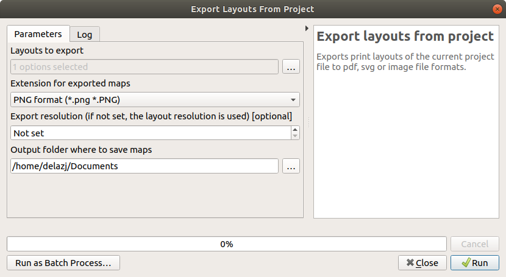
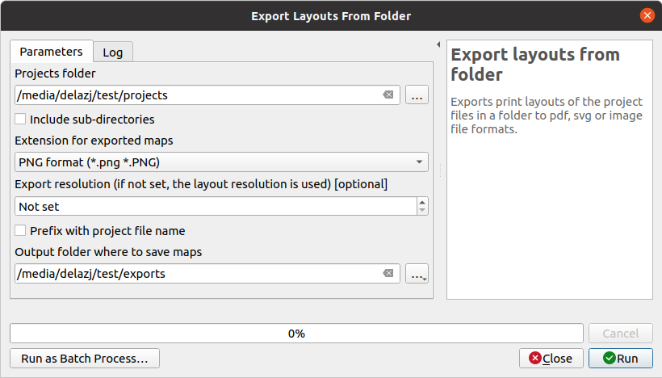

Welcome to Maps Printer's documentation!
============================================

* [Installing](#installing)
* [Using Maps Printer plugin](#using-maps-printer-plugin)
  * [Export layouts from project](#export-layouts-from-project)
  * [Export layouts from folder](#export-layouts-from-folder)


Even though multiple pages and atlas options have improved print layouts
usability and help enough to create many maps with few print layouts in a project,
you can still have many print layouts in your project. And when comes the time
to print or export them, it is not as fun as it could be. You indeed need to
open each print layout, wait till it renders, fill the export options,
wait till the export finishes to open the next layout. And so on...

If you find this process long and somehow boring (and even if you do not),
then Maps Printer plugin is designed for you. It offers an easy, simple and
quicker way to export print layouts to pdf, svg or image (jpg, tif, png, bmp...)
file format.

## Installing

The easiest way to install Maps Printer plugin in QGIS is through
the `Plugins --> Manage and Install plugins...` menu of QGIS.

## Using Maps Printer plugin

When installed, Maps Printer adds to the Processing Toolbox a new `Maps Printer`
entry with following algorithms:

* `Export layouts from project`: exports a set of layouts from the current project
* `Export layouts from folder`: exports all the layouts from all the projects
  files in a selected folder

A shortcut is also added to the Plugins menu with abovementioned tools and
a ``Help`` entry to open this documentation:

### Export layouts from project

Once you have created and set at your convenience your print layouts and wish to
export some of them,

1. Expand the `Maps Printer` entry in the `Processing Toolbox`
   panel and double-click `Export layouts from project`.
   The following dialog opens.

   

    The Export from Project algorithm dialog

1. Click the `...` next to the `Layouts to export` field.
1. Check the print layouts from the list that opens, validate.
1. Select the file format to use in `Extension for exported maps`.
   By default, its value is set to `.png` format but you can configure it
   (as explained below).
1. Enter a custom `Export resolution` to apply to all the outputs.
   If not set, each layout is exported using its own set resolution.
1. From the `...` menu of `Output folder of exported maps`,
   select `Save to Directory` and the output folder
1. Provide the `Output folder` location.
1. Click `Run` to execute.

   Maps will be output to the indicated folder. Check the log tab for issues,
   if any.

``` 
   **Customize the default extension of outputs**

   From the Processing options dialog (`Settings --> Options -->
   Processing`), under `Providers --> Maps Printer`, you can
   select the default format you wish to use while exporting.
```

### Export layouts from folder

The `Export layouts from folder` algorithm helps you export layouts
from projects in a folder.


1. Expand the `Maps Printer` entry in the `Processing Toolbox`
   panel and double-click `Export layouts from folder`.
   The following dialog opens.

   

    The Export from Folder algorithm dialog

1. Click the `...` button of the `Projects folder` field
   and select the folder to use as input
1. Check the `Include sub-directories` option if you want to also export
   layouts from the subfolders of the input director
1. Select the file format to use in `Extension for exported maps`.
   By default, its value is set to `.png` format but you can configure it
   (as explained above).
1. Enter a custom `Export resolution` to apply to all the outputs.
   If not set, each layout is exported using its own set resolution.
1. With many files (containing many layouts) being exported to the same directory,
   you can hit filename collision.
   Check `Prefix with project file name` to minimize the risk.
1. Provide the `Output folder` location.
1. Click `Run` to execute.

   QGIS will successively open each concerned project files and output their
   layouts' maps.

Plugin developped by **Harrissou Sant-anna** (CAUE 49)
